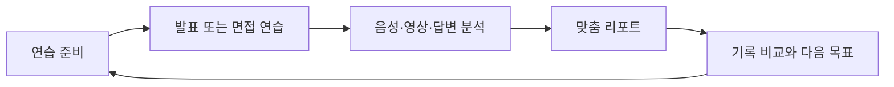
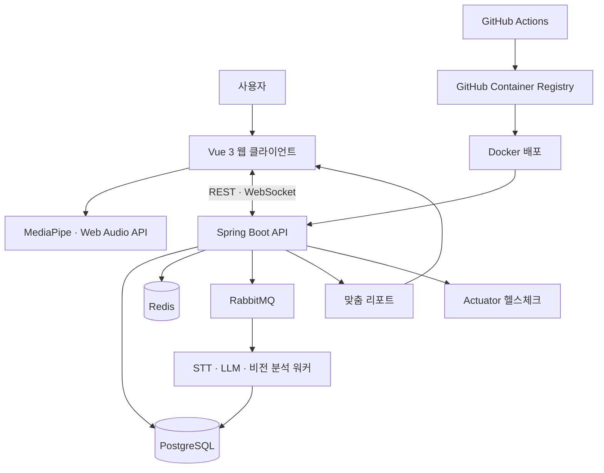

  <picture>
    <source media="(prefers-color-scheme: dark)" srcset="assets/aivo-logo-light.png" />
    <source media="(prefers-color-scheme: light)" srcset="assets/aivo-logo.png" />
    
  </picture>

<h1 align="center">AI 발표·면접 코칭 서비스</h1>

혼자 하는 연습에, 확신을 더하다.

  <a href="https://aivo.ai.kr">서비스 바로가기</a>
  &nbsp;·&nbsp;
  <a href="https://ssafy-pjt-presentation-source.vercel.app/">발표 자료 보기</a>

<a href="SOURCE_SNAPSHOT.md">공개 소스 구조 보기</a>

  SSAFY 15기 공통 프로젝트 &nbsp;·&nbsp; 백구

  <code>Web Service</code> &nbsp;·&nbsp; <code>6인 팀</code> &nbsp;·&nbsp; <code>박민규 · AI Engineering</code>

> 이 저장소는 aivo의 서비스 경험과 핵심 기술 구현을 소개하는 공개 포트폴리오입니다.

> aivo는 발표와 면접을 준비하는 사용자가 혼자서도 자신의 말하기 습관을 발견하고 다음 연습의 방향을 정할 수 있도록, 연습 과정의 음성·영상·답변을 분석해 맞춤 피드백과 누적 기록으로 연결하는 코칭 서비스입니다.

| 구분 | 내용 |
| --- | --- |
| 플랫폼 | 발표·면접 연습을 위한 웹 서비스 |
| 팀 구성 | SSAFY 15기 공통 프로젝트 · 백구 · 6인 |
| 나의 책임 | 한국어 STT 설정, 짧은 필러 보완, 발화 이벤트·점수 산출 파이프라인 |
| 검증 맥락 | 실제 서비스 화면, GPU 스모크 실행, 외부 유저 테스트 피드백 17건 |

## 문제

혼자 발표나 면접을 연습하면 **무엇을 고쳐야 하는지**, **이전보다 나아졌는지**, **실전에서 드러날 습관은 무엇인지**를 즉시 판단하기 어렵습니다. aivo는 피드백 공백, 기록의 단절, 실전 불안을 하나의 연습 경험 안에서 다룹니다.

## aivo의 해결

발표 자료 또는 면접 맥락을 바탕으로 연습하고, 발화·시선·자세·내용을 함께 살펴본 뒤, 결과를 다음 연습에 활용할 수 있는 기록으로 남깁니다. 사용자는 한 번의 결과가 아니라 반복에서 생기는 변화를 확인합니다.

## 핵심 기능

### 01. 발표 연습 — 자료 설정부터 실시간 코칭까지

발표 제목·설명과 자료를 입력하고, 기존 자료 재사용·질의응답 모드·목표 발표 시간을 설정합니다. 발표 중에는 현재 슬라이드와 실시간 발화 내용을 보며 말하기 속도·추임새·시선·기울어짐을 한 화면에서 확인합니다.

  
  

### 02. 발표 리포트 — 음성·몸짓·내용을 슬라이드별로

연습이 끝나면 음성·몸짓·내용 점수와 구간별 말하기 속도, 추임새·침묵 같은 근거를 확인합니다. 사용자는 개선이 필요한 순간을 찾아 다음 발표의 목표로 연결할 수 있습니다.

  

### 03. AI 면접 — 면접관과 질문을 내 맥락에 맞게

원하는 면접관 페르소나를 선택하고, 직무·경험·지원 맥락을 반영한 질문을 생성해 면접을 진행합니다. 같은 이력이라도 면접관의 성향에 따라 다른 방식으로 연습할 수 있습니다.

직무와 경력을 기본으로 회사·JD·자기소개서·포트폴리오를 선택 입력받습니다. LLM이 문서에서 프로젝트·기술·경험과 추가 확인이 필요한 근거를 정리한 뒤, 공통·인성·직무 기본 질문을 포함하는 규칙 기반 구성을 확정합니다. 이후 AI Hub 채용면접 데이터의 직군별 질문 유형을 참고해, 사용자의 맥락에 맞는 질문과 확인 포인트를 생성합니다.

  
  

### 04. 면접 리포트 — 답변 내용과 전달력을 함께

면접 결과를 음성·몸짓·내용 일치 관점에서 종합하고, 관련성·구조·명확성·전달력에 대한 피드백을 제공합니다. 숫자로 끝나지 않고 다음 답변에서 보완할 점을 확인할 수 있습니다.

  

## 연습 → 분석 → 기록

| 단계 | 사용자가 얻는 경험 |
| --- | --- |
| 연습 | 발표 자료·대본 또는 면접 맥락을 준비하고 말해 봅니다. |
| 분석 | 말하기 습관과 비언어적 표현, 답변 내용을 함께 확인합니다. |
| 기록 | 결과를 비교해 다음 연습에서 집중할 목표를 정합니다. |

## AI 음성 분석 구현

한국어 발표에서는 문법적으로 매끄러운 전사보다 실제 발화의 필러·반복·쉼을 보존하는 것이 중요했습니다. `faster-whisper-large-v3-turbo`의 단어별 시각 전사를 바탕으로, 짧은 필러를 보완하기 위한 8초 재전사와 0.3초 이내 중복 병합을 구현했습니다. 이후 Silero VAD·피치·RMS 연속성으로 필러·반복·긴 쉼·늘여 말하기·말하기 속도를 근거와 함께 코칭 이벤트로 만들었습니다.

| 실제 GPU 스모크 실행 | 결과 |
| --- | ---: |
| 실행 모델 | `faster-whisper-large-v3-turbo` (`int8_float16`) |
| 단어 타임스탬프 | **139개** |
| 생성 코칭 이벤트 | **8개** |
| 전사 시간 | **8.731초** |
| Real-time factor | **0.0751** (약 13.3배 빠른 전사) |
| 검증 이력 | 실험 당시 발표 코칭 테스트 **27 passed** |

> NVIDIA GeForce RTX 4050 Laptop GPU에서 단일 한국어 발표 음성을 실행한 실험 결과입니다. 전사 시간과 자원 사용량은 오디오 길이·GPU·모델 캐시 상태에 따라 달라집니다. `27 passed`는 해당 실험 시점의 발표 코칭 테스트 검증 이력입니다. 분석 결과는 발표 코칭을 위한 지표이며 의료적 진단에 사용하지 않습니다.

## AI 기여 및 의사결정

**박민규 · AI**

발표·면접 코칭에서 필요한 것은 문법적으로 매끄러운 받아쓰기가 아니라, 사용자가 실제로 보완해야 할 필러·반복·쉼을 시간 근거와 함께 찾는 일이었습니다. 이를 위해 전사, 음성 구간 분석, 피드백 생성이 이어지는 파이프라인을 설계·구현했습니다.

| 과제 | 해결 방식 | 포트폴리오 근거 |
| --- | --- | --- |
| 짧은 필러 누락 | 전체 전사를 기준으로 유지하고 8초 독립 창 재전사 결과를 병합 | 필러를 보존하면서 문맥 단절을 줄임 |
| 중복된 필러 검출 | 0.3초 이내 동일 검출을 하나의 이벤트로 병합 | 사용자에게 과도한 감점·중복 피드백을 방지 |
| 쉼과 늘여 말하기 구분 | Silero VAD, 피치, RMS 연속성과 시간 기준을 함께 사용 | 시간·근거·신뢰도를 가진 코칭 이벤트 생성 |
| 내용과 전달력의 혼합 | LLM 답변 피드백과 비유창성 분석을 분리 | 면접 리포트에서 답변 내용과 말하기 습관을 각각 개선 |

### 모델 탐색과 최종 선택

한 모델의 전사문만 보고 결정하지 않기 위해 `faster-whisper` 2종, CrisperWhisper 2종, SeloWhisper, Tellang Whisper까지 **6개 후보**를 같은 벤치마크 규격에 연결했습니다. 모델별로 로드·전사·이벤트 분석 시간과 CPU·RAM·GPU·VRAM, Real-time factor를 같은 형식으로 수집하도록 만들었습니다.

최종 기본 모델은 `faster-whisper-large-v3-turbo`입니다. 다른 후보보다 절대적으로 정확하다고 단정해서가 아니라, 한국어 단어 타임스탬프를 제공하고 실제 RTX 4050 GPU에서 전사부터 코칭 이벤트 생성까지 끝까지 검증된 후보였기 때문입니다. CrisperWhisper와의 짧은 비교 오디오에서는 결과 차이를 확인했지만, 정답 전사가 없는 비교였으므로 정확도 우열의 근거로 사용하지 않았습니다.

> 모델 선택 기준은 실서비스 파이프라인의 실행 가능성, 단어 시각 근거, 자원 측정 가능성입니다. 모델 정확도 우열은 라벨링된 발표 음성의 precision·recall 비교가 완료된 뒤에만 주장합니다.

### 검증 범위

- 단일 한국어 발표 음성의 GPU 스모크 실행에서 단어 타임스탬프 **139개**, 코칭 이벤트 **8개**를 생성했습니다.
- 전사 시간은 **8.731초**, Real-time factor는 **0.0751**로 측정했습니다.
- 발표 코칭 테스트 **27개**의 실험 시점 검증 이력을 남겼습니다.

> 수치는 특정 GPU·오디오 조건에서의 실행 결과이며, 사용자 점수의 절대적 정확도를 뜻하지 않습니다. 리포트는 연습 방향을 제안하는 코칭 도구로 설계했습니다.

## 외부 유저 테스트

aivo는 SSAFY 공통 프로젝트 유저 테스트 프로그램에 선정되어, 삼성 경력사원 임직원이 서비스를 체험하고 작성한 피드백을 받았습니다. 이 경험은 기능을 만들었다는 사실을 넘어, 실제 사용자가 어디에서 결과를 이해하기 어렵고 다음 행동을 망설이는지를 확인하는 검증 과정이었습니다.

유저 테스트 리포트에는 **17건**의 피드백이 기록되었으며, 우선 검토가 필요한 Major **10건**, 경험 개선을 위한 Minor **7건**으로 분류되었습니다. 피드백은 UI·접근성, 리포트 탐색·동기화, AI 피드백 해석·개인화, 업로드·준비 흐름에 집중되었습니다.

> 이 결과는 피드백을 수집한 사실과 개선 기회를 보여줍니다. 모든 항목을 해결했거나 서비스 효과가 검증되었다는 뜻은 아닙니다. 익명화한 상세 정리는 [외부 유저 테스트](docs/user-testing.md)에서 확인할 수 있습니다.

## 공개 소스 범위

이 저장소는 운영 서비스 전체를 복제한 실행 레포가 아니라, 실제 서비스 화면과 핵심 구현을 검토할 수 있도록 정리한 공개 스냅샷입니다. 특히 박민규가 담당한 발표 음성 분석 코드는 [`models/filer/src/`](backend-fastapi-main/models/filer/src/)에서 확인할 수 있습니다.

- **검토 가능한 구현**: 한국어 단어 타임스탬프 전사, 8초 재전사 기반 필러 보완, VAD·피치·RMS 기반 발화 이벤트·점수 산출
- **공개하지 않은 운영 요소**: 환경 변수, 사용자 음성·영상, 모델 가중치, DB·메시지 브로커·클라우드 연결 설정, 배포·CI 구성
- **스냅샷 내 인터페이스 코드**: 일부 API 폴백·메시지 작업자에는 계약 검토와 화면 데모를 위한 목업 또는 후속 구현 TODO가 포함됩니다. 이를 실제 추론·운영 결과로 주장하지 않습니다.

따라서 이 저장소는 코드 리뷰와 포트폴리오 열람을 위한 자료이며, 실행 가능 범위와 제외 항목은 [공개 소스 스냅샷](SOURCE_SNAPSHOT.md)에서 확인할 수 있습니다.

## 기술 스택

| 영역 | 기술 |
| --- | --- |
| Web | Vue 3, Vite, Pinia, Vue Router |
| Media | MediaPipe, Web Audio API |
| Application | Java, Spring Boot, Spring Security, Spring Data JPA, WebSocket |
| AI | faster-whisper-large-v3-turbo, LLM, MediaPipe Tasks Vision, Silero VAD |
| Data | PostgreSQL, Redis, RabbitMQ |
| Team delivery history | Docker, GitHub Actions, GitHub Container Registry, Spring Boot Actuator (운영 설정은 공개하지 않음) |

## 아키텍처

아래는 팀이 구성한 서비스 아키텍처입니다. 이 공개 스냅샷에는 운영 배포·CI 설정과 연결 정보가 포함되지 않으므로, 다이어그램의 모든 구성 요소를 이 저장소만으로 실행할 수 있다는 뜻은 아닙니다.

## Team 백구

aivo는 아래 6명이 함께 만든 프로젝트입니다.

| 역할 | 팀원 |
| --- | --- |
| Backend | 최현철 · 윤성빈 · 채승규 |
| Frontend | 서가은 |
| AI | 박민규 |
| Infrastructure | 윤재용 |

## 링크

- [aivo 서비스](https://aivo.ai.kr)
- [aivo 발표 자료](https://ssafy-pjt-presentation-source.vercel.app/)
- [공개 소스 스냅샷](SOURCE_SNAPSHOT.md)
- [포트폴리오 근거 지도](docs/evidence-map.md)
- [외부 유저 테스트 요약](docs/user-testing.md)

## 이용 안내

이 저장소는 포트폴리오 열람을 위해 공개합니다. 코드·문서·이미지의 재사용, 수정, 배포는 사전 문의가 필요합니다.
