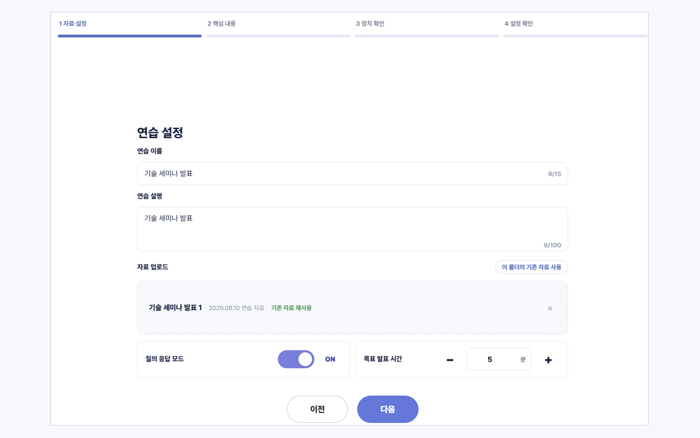
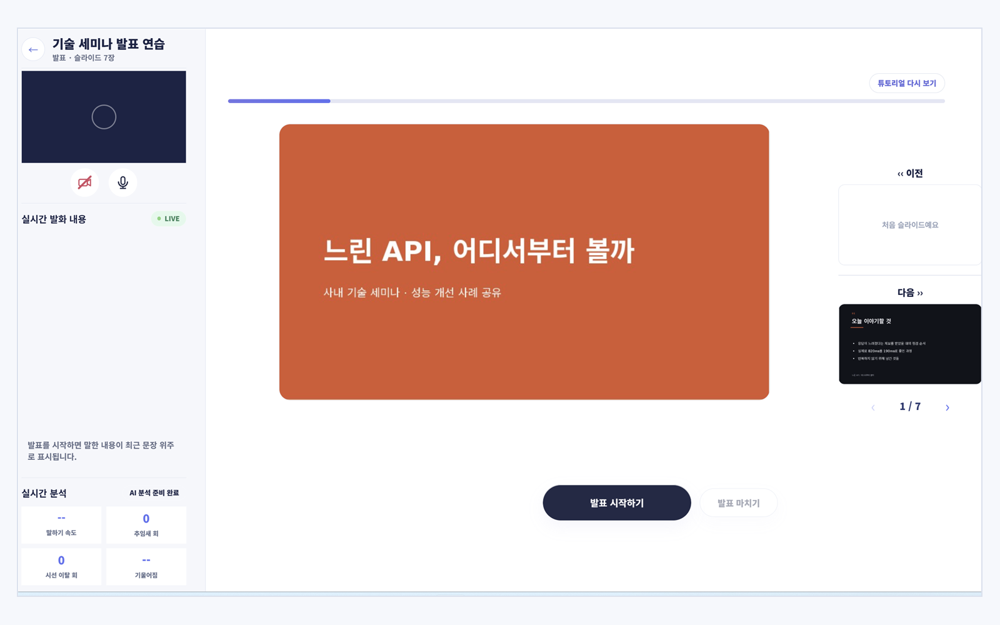
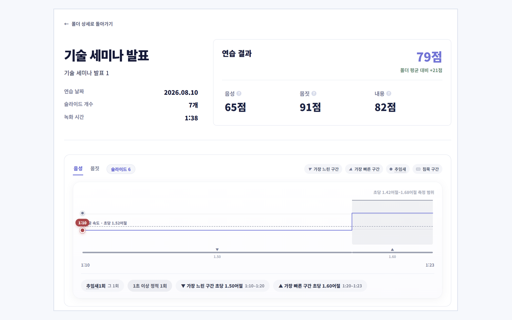
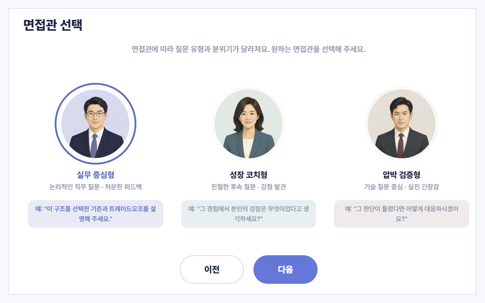
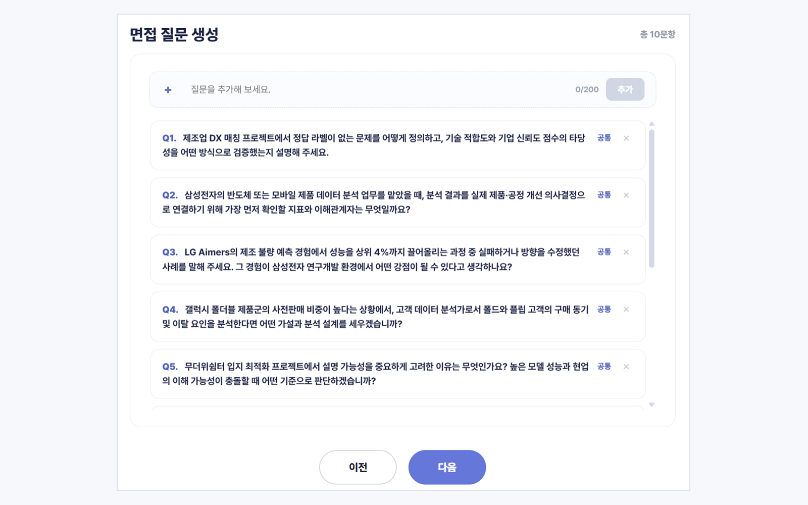
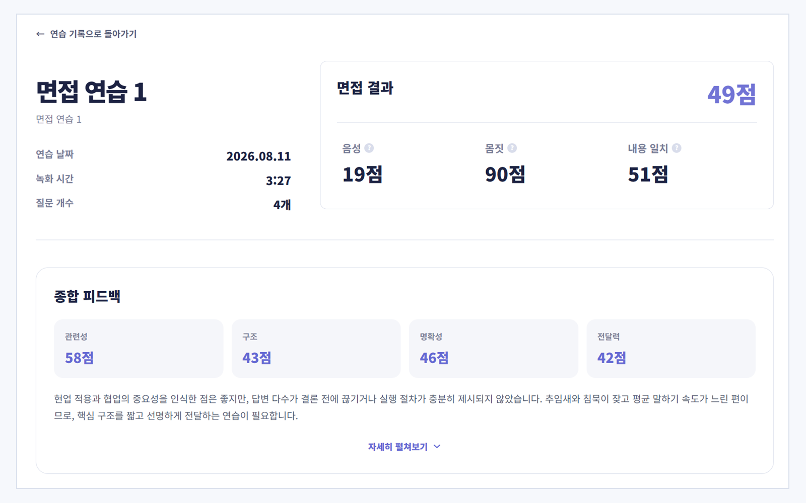
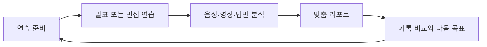
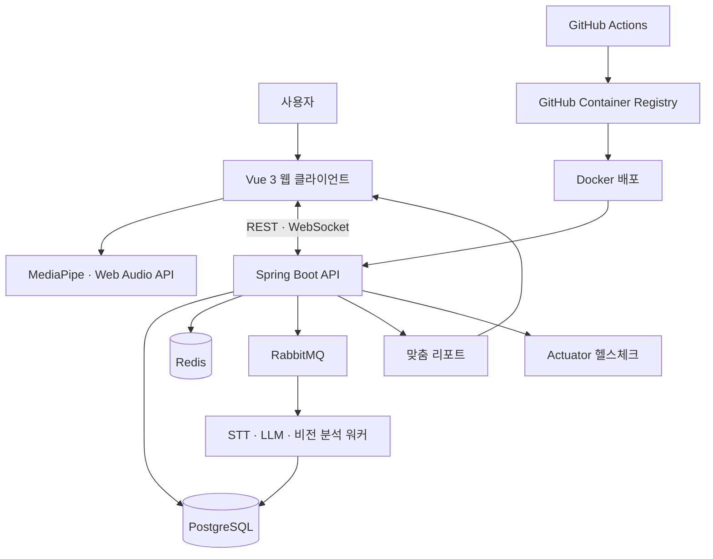

  <picture>
    <source media="(prefers-color-scheme: dark)" srcset="assets/aivo-logo-light.png" />
    <source media="(prefers-color-scheme: light)" srcset="assets/aivo-logo.png" />
    
  </picture>

  <strong>AI 발표·면접 코칭 서비스</strong> 
  혼자 하는 연습에, 확신을 더하다.

  <a href="https://aivo.ai.kr">서비스 바로가기</a>
  &nbsp;·&nbsp;
  <a href="https://ssafy-pjt-presentation-source.vercel.app/">발표 자료 보기</a>

  SSAFY 15기 공통 프로젝트 &nbsp;·&nbsp; 백구

> 이 저장소는 aivo의 서비스 경험과 핵심 기술 구현을 소개하는 공개 포트폴리오입니다.

> aivo는 발표와 면접을 준비하는 사용자가 혼자서도 자신의 말하기 습관을 발견하고 다음 연습의 방향을 정할 수 있도록, 연습 과정의 음성·영상·답변을 분석해 맞춤 피드백과 누적 기록으로 연결하는 코칭 서비스입니다.

## 목차

- [문제](#문제)
- [aivo의 해결](#aivo의-해결)
- [핵심 기능](#핵심-기능)
- [연습 → 분석 → 기록](#연습--분석--기록)
- [AI 음성 분석 구현](#ai-음성-분석-구현)
- [기술 스택](#기술-스택)
- [아키텍처](#아키텍처)
- [Team 백구](#team-백구)
- [링크](#링크)

## 문제

혼자 발표나 면접을 연습하면 **무엇을 고쳐야 하는지**, **이전보다 나아졌는지**, **실전에서 드러날 습관은 무엇인지**를 즉시 판단하기 어렵습니다. aivo는 피드백 공백, 기록의 단절, 실전 불안을 하나의 연습 경험 안에서 다룹니다.

## aivo의 해결

발표 자료 또는 면접 맥락을 바탕으로 연습하고, 발화·시선·자세·내용을 함께 살펴본 뒤, 결과를 다음 연습에 활용할 수 있는 기록으로 남깁니다. 사용자는 한 번의 결과가 아니라 반복에서 생기는 변화를 확인합니다.

## 핵심 기능

### 01. 발표 연습 — 자료 설정부터 실시간 코칭까지

발표 제목·설명과 자료를 입력하고, 기존 자료 재사용·질의응답 모드·목표 발표 시간을 설정합니다. 발표 중에는 현재 슬라이드와 실시간 발화 내용을 보며 말하기 속도·추임새·시선·기울어짐을 한 화면에서 확인합니다.

  
  

### 02. 발표 리포트 — 음성·몸짓·내용을 슬라이드별로

연습이 끝나면 음성·몸짓·내용 점수와 구간별 말하기 속도, 추임새·침묵 같은 근거를 확인합니다. 사용자는 개선이 필요한 순간을 찾아 다음 발표의 목표로 연결할 수 있습니다.

  

### 03. AI 면접 — 면접관과 질문을 내 맥락에 맞게

원하는 면접관 페르소나를 선택하고, 직무·경험·지원 맥락을 반영한 질문을 생성해 면접을 진행합니다. 같은 이력이라도 면접관의 성향에 따라 다른 방식으로 연습할 수 있습니다.

직무와 경력을 기본으로 회사·JD·자기소개서·포트폴리오를 선택 입력받습니다. LLM이 문서에서 프로젝트·기술·경험과 추가 확인이 필요한 근거를 정리한 뒤, 공통·인성·직무 기본 질문을 포함하는 규칙 기반 구성을 확정합니다. 이후 AI Hub 채용면접 데이터의 직군별 질문 유형을 참고해, 사용자의 맥락에 맞는 질문과 확인 포인트를 생성합니다.

  
  

### 04. 면접 리포트 — 답변 내용과 전달력을 함께

면접 결과를 음성·몸짓·내용 일치 관점에서 종합하고, 관련성·구조·명확성·전달력에 대한 피드백을 제공합니다. 숫자로 끝나지 않고 다음 답변에서 보완할 점을 확인할 수 있습니다.

  

## 연습 → 분석 → 기록

| 단계 | 사용자가 얻는 경험 |
| --- | --- |
| 연습 | 발표 자료·대본 또는 면접 맥락을 준비하고 말해 봅니다. |
| 분석 | 말하기 습관과 비언어적 표현, 답변 내용을 함께 확인합니다. |
| 기록 | 결과를 비교해 다음 연습에서 집중할 목표를 정합니다. |

## AI 음성 분석 구현

한국어 발표에서는 문법적으로 매끄러운 전사보다 실제 발화의 필러·반복·쉼을 보존하는 것이 중요했습니다. `faster-whisper-large-v3-turbo`의 단어별 시각 전사를 바탕으로, 짧은 필러를 보완하기 위한 8초 재전사와 0.3초 이내 중복 병합을 구현했습니다. 이후 Silero VAD·피치·RMS 연속성으로 필러·반복·긴 쉼·늘여 말하기·말하기 속도를 근거와 함께 코칭 이벤트로 만들었습니다.

| 실제 GPU 스모크 실행 | 결과 |
| --- | ---: |
| 실행 모델 | `faster-whisper-large-v3-turbo` (`int8_float16`) |
| 단어 타임스탬프 | **139개** |
| 생성 코칭 이벤트 | **8개** |
| 전사 시간 | **8.731초** |
| Real-time factor | **0.0751** (약 13.3배 빠른 전사) |
| 검증 이력 | 실험 당시 발표 코칭 테스트 **27 passed** |

> NVIDIA GeForce RTX 4050 Laptop GPU에서 단일 한국어 발표 음성을 실행한 실험 결과입니다. 전사 시간과 자원 사용량은 오디오 길이·GPU·모델 캐시 상태에 따라 달라집니다. `27 passed`는 해당 실험 시점의 발표 코칭 테스트 검증 이력입니다. 분석 결과는 발표 코칭을 위한 지표이며 의료적 진단에 사용하지 않습니다.

## 기술 스택

| 영역 | 기술 |
| --- | --- |
| Web | Vue 3, Vite, Pinia, Vue Router |
| Media | MediaPipe, Web Audio API |
| Application | Java, Spring Boot, Spring Security, Spring Data JPA, WebSocket |
| AI | faster-whisper-large-v3-turbo, LLM, MediaPipe Tasks Vision, Silero VAD |
| Data | PostgreSQL, Redis, RabbitMQ |
| Delivery | Docker, GitHub Actions, GitHub Container Registry, Spring Boot Actuator |

## 아키텍처

## Team 백구

aivo는 아래 6명이 함께 만든 프로젝트입니다.

| 역할 | 팀원 |
| --- | --- |
| Backend | 최현철 · 윤성빈 · 채승규 |
| Frontend | 서가은 |
| AI | 박민규 |
| Infrastructure | 윤재용 |

## 링크

- [aivo 서비스](https://aivo.ai.kr)
- [aivo 발표 자료](https://ssafy-pjt-presentation-source.vercel.app/)
