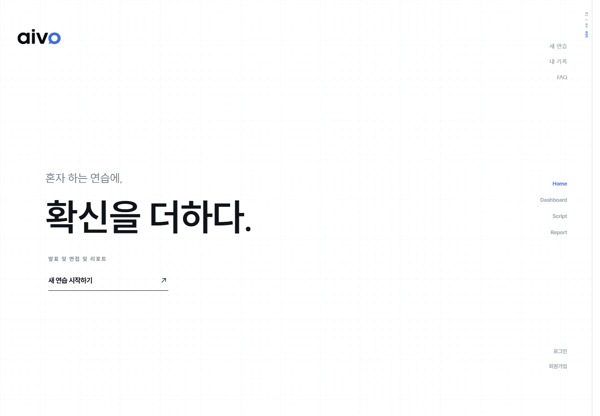
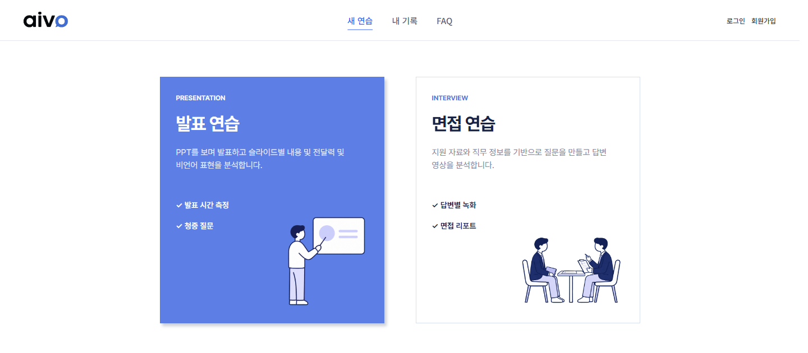
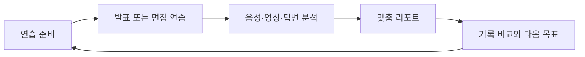
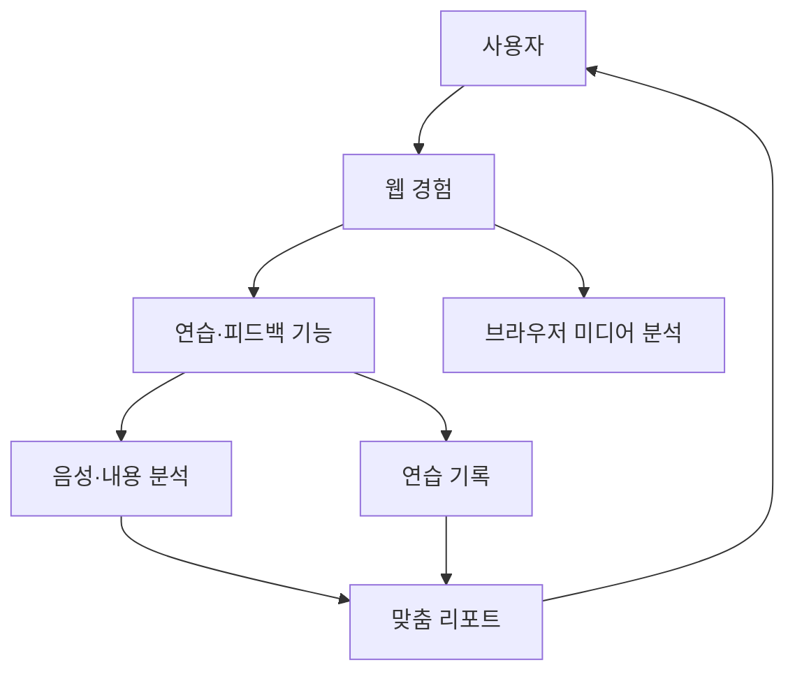

  

<h1 align="center">aivo</h1>

  <strong>AI 발표·면접 코칭 서비스</strong> 
  혼자 하는 연습에, 확신을 더하다.

  <a href="https://aivo.ai.kr">서비스 바로가기</a>
  &nbsp;·&nbsp;
  <a href="https://ssafy-pjt-presentation-source.vercel.app/">발표 자료 보기</a>

  <code>SSAFY 15기</code>&nbsp;&nbsp; <code>팀 백구</code>&nbsp;&nbsp; <code>Web Application</code>&nbsp;&nbsp; <code>6 members</code>

> aivo는 발표와 면접을 준비하는 사용자가 혼자서도 자신의 말하기 습관을 발견하고 다음 연습의 방향을 정할 수 있도록, 연습 과정의 음성·영상·답변을 분석해 맞춤 피드백과 누적 기록으로 연결하는 코칭 서비스입니다.

## 목차

- [문제](#문제)
- [aivo의 해결](#aivo의-해결)
- [핵심 기능](#핵심-기능)
- [연습 → 분석 → 기록](#연습--분석--기록)
- [기술적 성과](#기술적-성과)
- [기술 스택](#기술-스택)
- [아키텍처](#아키텍처)
- [팀](#팀)
- [링크](#링크)

## 문제

혼자 발표나 면접을 연습하면 **무엇을 고쳐야 하는지**, **이전보다 나아졌는지**, **실전에서 드러날 습관은 무엇인지**를 즉시 판단하기 어렵습니다. aivo는 피드백 공백, 기록의 단절, 실전 불안을 하나의 연습 경험 안에서 다룹니다.

  

## aivo의 해결

발표 자료 또는 면접 맥락을 바탕으로 연습하고, 발화·시선·자세·내용을 함께 살펴본 뒤, 결과를 다음 연습에 활용할 수 있는 기록으로 남깁니다. 사용자는 한 번의 결과가 아니라 반복에서 생기는 변화를 확인합니다.

## 핵심 기능

### 01. 발표·면접 연습

발표 자료와 대본을 준비해 발표를 연습하거나, 지원 맥락을 바탕으로 질문에 답하며 면접을 연습합니다. 연습 전 입력부터 결과 확인까지 흐름이 끊기지 않도록 구성했습니다.

  

### 02. 실시간 분석

연습 중 말하기 속도·추임새·침묵 구간과 시선·자세를 확인해 전달 방식의 개선 지점을 바로 인식합니다.

### 03. 맞춤 리포트와 기록

연습이 끝나면 슬라이드·질문 단위의 발화와 분석 결과를 비교하고, 누적 기록을 통해 강점·개선 지점·다음 연습 목표를 확인합니다.

## 연습 → 분석 → 기록

| 단계 | 사용자가 얻는 경험 |
| --- | --- |
| 연습 | 발표 자료·대본 또는 면접 맥락을 준비하고 말해 봅니다. |
| 분석 | 말하기 습관과 비언어적 표현, 답변 내용을 함께 확인합니다. |
| 기록 | 결과를 비교해 다음 연습에서 집중할 목표를 정합니다. |

## 기술적 성과

한국어 말하기의 필러·반복·긴 쉼을 더 빠르고 정확하게 파악하기 위해, 전사 결과와 시간 정보를 보정해 비유창성 표현을 분리해 분석했습니다.

| 지표 | 개선 결과 |
| --- | --- |
| STT 처리 시간 | **41.5초 → 4.3초** |
| 필러 탐지율 | **5.5% → 76%** |

## 기술 스택

| 영역 | 기술 |
| --- | --- |
| Web | Vue 3, Vite, Pinia, Vue Router |
| Media | MediaPipe, Web Audio API |
| Application | Java, Spring Boot, Spring Security, Spring Data JPA, WebSocket |
| AI | faster-whisper-large-v3-turbo, LLM, MediaPipe Tasks Vision |
| Data | PostgreSQL, Redis, RabbitMQ |
| Delivery | Docker, GitHub Actions, GitHub Container Registry |

## 아키텍처

## 팀

| 구성 | 인원 |
| --- | --- |
| Backend | 3 |
| Frontend | 1 |
| AI | 1 |
| Infrastructure | 1 |
| 합계 | 6 |

## 링크

- [aivo 서비스](https://aivo.ai.kr)
- [aivo 발표 자료](https://ssafy-pjt-presentation-source.vercel.app/)
